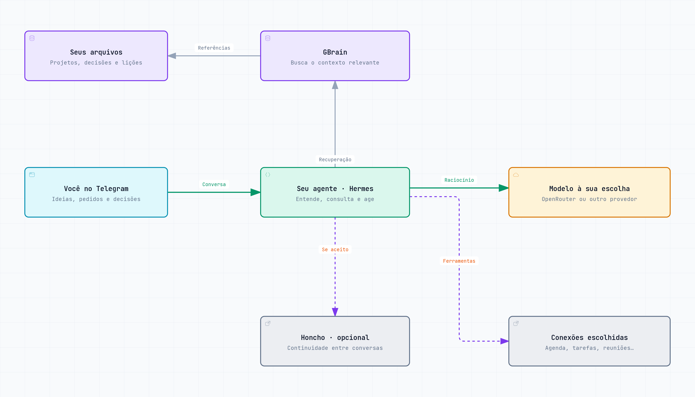

# Aethon-StarterAI — seu agente pessoal como segundo cérebro

Ideias no Telegram, decisões espalhadas, reuniões acumuladas e projetos que
precisam andar. O Aethon-StarterAI é uma base para criar um agente que ajuda a
organizar esse contexto e recuperá-lo quando você precisa decidir ou agir.

Você escolhe o nome e conversa com ele. Com [Hermes Agent](https://hermes-agent.nousresearch.com/docs)
como motor, ele combina arquivos organizados, busca de memória e ferramentas
que você conectar. Seu trabalho, seus negócios e sua vida pessoal podem ter
continuidade entre conversas, sem depender de preencher um formulário diário.

## Para quem é

| Quem usa | Como pode usar |
|---|---|
| **Empreendedores e fundadores** | Retomar hipóteses de negócio, comparar caminhos e acompanhar decisões de produto sem reexplicar o projeto a cada conversa |
| **Empresários e gestores** | Organizar contexto de reuniões, compromissos e projetos; consultar por que uma decisão foi tomada e preparar os próximos passos |
| **Autônomos e profissionais** | Separar demandas de clientes, encontrar referências e transformar ideias em ações com contexto |
| **Pessoas com muitos interesses e responsabilidades** | Organizar planos pessoais, conteúdos para estudar depois e assuntos que merecem atenção |
| **Desenvolvedores e equipes técnicas** | Adaptar a base, conectar ferramentas e manter decisões e aprendizados próximos da execução |

A instalação é pessoal. Uso por uma equipe inteira, acesso de vários usuários e
dados empresariais compartilhados exigem um desenho próprio de permissões.

## O que pedir no dia a dia

- **“Onde paramos no lançamento? O que já decidimos e o que falta?”** — retomar
  contexto registrado, distinguindo decisões de pendências.
- **“Aqui estão as notas da reunião. Separe decisões e próximos passos.”** —
  organizar material fornecido, com origem, sem inventar responsáveis ou prazos.
- **“Compare estas duas propostas com os critérios que combinamos.”** — usar
  critérios recuperados e indicar quando faltar informação.
- **“Guarda este conteúdo para eu estudar depois.”** — organizar uma referência
  para sua consulta; isso não significa estudar por você ou criar uma rotina.
- **“Mostre o processo em um diagrama.”** — tornar um fluxo mais fácil de entender,
  revisar e compartilhar.

Agenda, Tasks, e-mail, YouTube e reuniões podem ampliar esses usos depois de
configurados. Ter uma integração conectada não autoriza envio de mensagens nem
cria automações por conta própria.

## Como o contexto acompanha você



[Diagrama interativo para baixar e abrir no navegador](docs/assets/segundo-cerebro.html).
O conteúdo está em português; os controles do visualizador estão em inglês.

**Converse → consulte o contexto → decida ou execute → registre o que merece ficar.**
Os arquivos guardam as fontes, decisões e lições; GBrain ajuda a recuperar o que
é relevante. Honcho pode complementar a continuidade e é oferecido no onboarding,
com possibilidade de recusa. Ele não substitui seus arquivos.

### Você escolhe o modelo

O template não fica preso a GLM ou DeepSeek. Essas famílias são recomendações
iniciais do projeto, não requisitos. Você pode escolher outro modelo disponível
no OpenRouter ou outro provedor compatível com a sua instalação do Hermes.
Confira suporte às ferramentas, qualidade nas suas tarefas e custo no
[catálogo atual](https://openrouter.ai/models). A instalação preserva sua escolha;
não troca o modelo automaticamente.

## Começar pelo Telegram

Com Hermes funcionando e seu bot já pareado, envie:

> https://github.com/AiLucasdz/Aethon-StarterAI
> Quero iniciar a configuração do meu agente com este template.

“Iniciar”, “começar”, “configurar” e “instalar” autorizam o mesmo fluxo. O agente
precisa conseguir ler o repositório e executar comandos no servidor. Um link
sozinho não instala nada. O [guia do instalador](docs/instalar-pelo-telegram.md)
orienta identificar o perfil correto, preservar configurações e verificar o resultado.

**O agente executa esses passos.** Você não precisa escolher pastas nem colar
comandos; responde às perguntas necessárias e autentica suas contas quando preciso.

1. Preparar os arquivos privados e as instruções do runtime.
2. Perguntar o nome do agente e receber uma apresentação livre por áudio, texto,
   PDF ou resumo de outra IA: rotina, dificuldades, preferências e ajuda desejada.
   O agente organiza e pergunta só o que faltar; é possível pular e retomar depois.
3. Instalar GBrain e o plugin de recuperação no perfil que atende a conversa.
4. Se Honcho for aceito, iniciar o setup nativo na mesma instalação. Sem terminal
   interativo, informar autenticação pendente e o comando para continuar com segurança.
5. Conferir instruções carregadas e recuperação pelo consumidor real antes de
   anunciar funcionamento. Outros pedidos podem ser atendidos durante o onboarding.

A base não troca seu modelo, bot ou pareamento. VPS/Hermes/Telegram são
pré-requisitos; o vídeo de preparação ainda está pendente. Consulte a
[instalação escrita](docs/instalacao.md). Há um
[link de indicação opcional de VPS](https://www.hostinger.com/br?REFERRALCODE=O23ELLUCA0ZD);
usá-lo não é requisito.

## O que fica onde

| Local | Responsabilidade |
|---|---|
| Checkout deste template | Código, instruções genéricas e esqueletos; sem dados da instalação |
| `HERMES_HOME/SOUL.md` | Identidade e bloco operacional gerenciado; texto externo preservado |
| `HERMES_HOME/memories/` e `state/` | Memória nativa e estado privado de onboarding/módulos |
| `VAULT_PATH/AGENTS.md` | Regras e mapa das fontes privadas |
| `VAULT_PATH/08_DECISOES/decisoes.md` | Escolhas confirmadas, motivo, origem e revisão |
| `VAULT_PATH/09_AGENTES/licoes-operacionais.md` | Aprendizados observados, evidência e condição de aplicação |
| Demais pastas do vault | Identidade, projetos, capturas, diário, relações e contexto exportável |
| `<HERMES_HOME>-gbrain/.gbrain` | Base nova do GBrain, fora do runtime e do checkout |

Os caminhos privados são configuráveis. Uma instalação GBrain existente é
preservada. Obsidian é opcional: o [vault](docs/vault.md) é Markdown comum.
Honcho complementa a continuidade; não substitui as fontes canônicas.

## Capturar, recuperar e aplicar

O [contrato de memória](agent/memoria.md) orienta registrar somente informação
durável pertinente, com origem, na fonte correta. Decisão não é mera sugestão;
lição precisa de evidência. Estado temporário permanece no projeto. Antes de
repetir uma escrita no GBrain, consultar o registro existente; a configuração
inicial sem embeddings não garante deduplicação automática.

O plugin consulta regras, decisões e lições relevantes e usa o MCP GBrain já
aberto pelo Hermes. Atua no CLI do perfil e na DM do dono configurado; exclui
grupos, cron e subagentes. Tem limite de 6.000 caracteres e timeout de 6 segundos
para GBrain, sem chamada própria a modelo. Não é um gravador de toda mensagem:
a captura e a aplicação ainda dependem do agente seguindo as instruções.

GBrain novo começa com busca textual sem chave de embeddings. Busca semântica
exige configuração adicional. Desempenho, contexto limitado, mecanismos nativos,
custo e código legível são princípios da base; veja [limites](docs/performance.md)
e [ativação de memória](docs/segundo-cerebro.md).

## Conexões, privacidade e atualizações

Agenda, Tasks, Gmail, YouTube, reuniões e outras conexões são opcionais. O
[catálogo](docs/catalogo-modulos.md) descreve possibilidades, não adaptadores
já instalados. Registrar intenção não conecta contas nem agenda rotinas;
cada integração exige configuração e consulta real.

Credenciais entram pelo fluxo seguro do serviço, nunca no chat, Git ou argumentos
de comandos. Runtime e vault ficam fora do checkout. Telegram, modelo, Honcho e
outros serviços podem processar conteúdo conforme sua configuração; armazenamento
local não significa processamento exclusivamente local. Leia [privacidade](docs/privacidade.md).

[Atualizações](docs/atualizacoes.md) preservam personalizações e recusam conflitos
no bloco gerenciado. **Backup nativo do Hermes não cobre o vault nem a base
GBrain externos.** Após restaurar o runtime, reinstale/verifique o plugin que
aponta para o checkout. Intenção de backup no onboarding não cria backup.

## Estado da implementação

Instalação, retomada e recuperação foram verificadas em runtime isolado com
Hermes e GBrain reais. A instalação completa por conversa em um Telegram novo,
autenticação real do Honcho e utilidade cotidiana ainda precisam de validação.
A base tem mecanismos de memória; isso não é promessa de lembrar tudo nem de
aprender corretamente em toda conversa.

## Validar e contribuir

Python 3.11+, ambiente Linux e Hermes com suporte aos plugins utilizados são
necessários para o fluxo executável. Para instalar GBrain novo, o instalador
precisa de Bun ou de um binário GBrain disponível; dependências ausentes são
informadas, não tratadas como sucesso.

```bash
python3 -m unittest discover -s tests -v
```

Teste opcional em diretórios temporários, com Hermes e GBrain já instalados:

```bash
python3 scripts/testar-runtime.py --hermes /caminho/para/hermes --gbrain /caminho/para/gbrain
```

Esse teste usa dados fictícios e verifica integração nativa; não autentica Honcho
nem envia mensagens ao Telegram. Veja [scripts disponíveis](docs/modulos-rotina.md).
Antes de publicar, revise também metadados Git, histórico, tags e artefatos.

Licença [MIT](LICENSE), sem garantia. Infraestrutura, API do modelo e serviços
contratados são custos da própria instalação.
